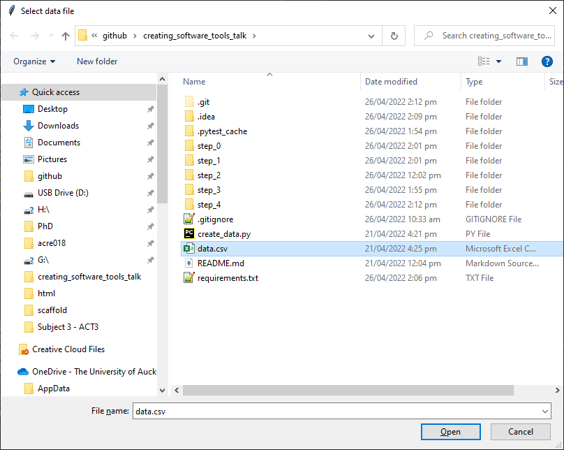
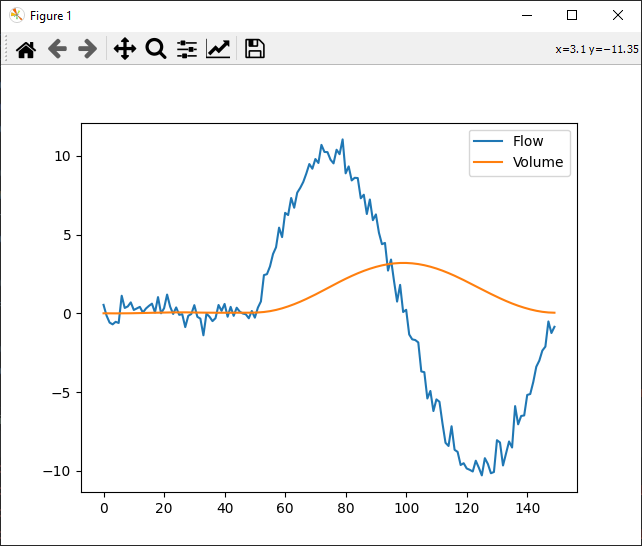

.. Volume Calculator documentation master file, created by
   sphinx-quickstart on Tue Apr 26 14:12:39 2022.
   You can adapt this file completely to your liking, but it should at least
   contain the root `toctree` directive.

Welcome to Volume Calculator's documentation!
=============================================
Volume Calculator is a tool used to calculate volume from measured flow data. It prompts the user to select
a data file, then plots a graph of input flow data along with calculated volume. Volume calculator was created
as an example application to demonstrate how to create a software tool from a simple script.

Features
========
- Calculates Volume from flow data by filtering noise then integrating.
- Parameters configurable using external configuration file.

Usage
=====
The sources can be downloaded from the `Github repo`_.

.. _Github repo: https://github.com/acreegan/creating_software_tools_talk

Once you have downloaded the sources, install the requirements using:

.. code-block:: console

   $ pip install -r requirements.txt

And run the code with:

.. code-block:: console

   $ cd step_4
   $ python main_step_4.py

You will be prompted to select an input data file using a file select dialog.

Once selected, the calculated volume will be plotted along with the input data:

Data Format
-----------
The required input data format is a single column csv file with floating point numbers representing sampled
flow values. Time step is assumed to be constant, and is specified in the configuration. See data.csv as an
example.

Configuration
-------------

.. code-block:: json

   {
     "filter_window_length": 20,
     "filter_order":   2,
     "dx" : 0.01,
     "initial" : 0
   }

Above are the configuration parameters available for Volume Calculator.

**filter_window_length**: The number of samples used in the low-pass filter window.

**filter_order**: The order of the polynomial used to fit samples in the low-pass filter window

**dx**: The time step used when integrating flow. This should be set to 1/f where f is the flow sampling frequency

**initial**: The initial value used when integrating flow. This should normally be 0

.. toctree::
   :maxdepth: 2
   :caption: Contents:

